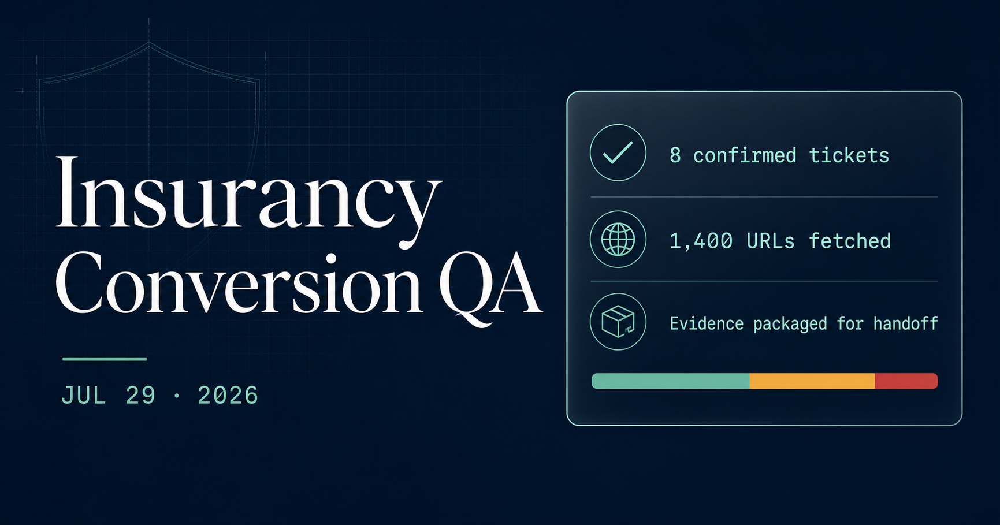
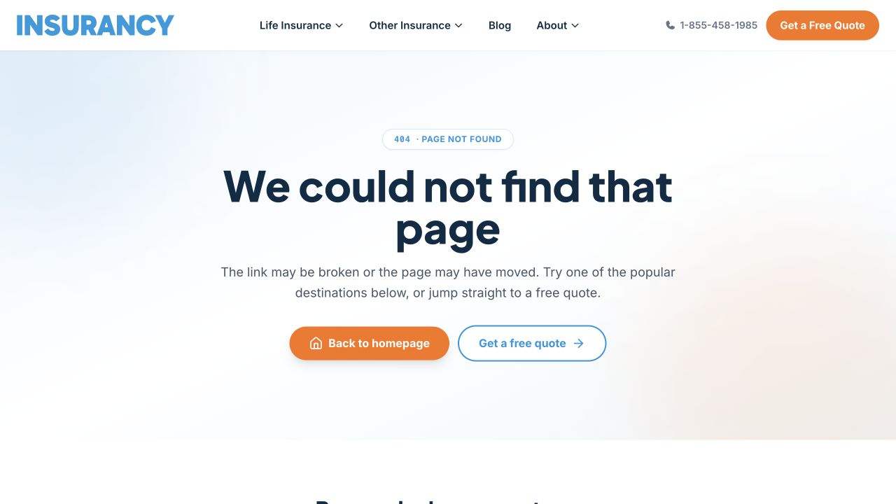
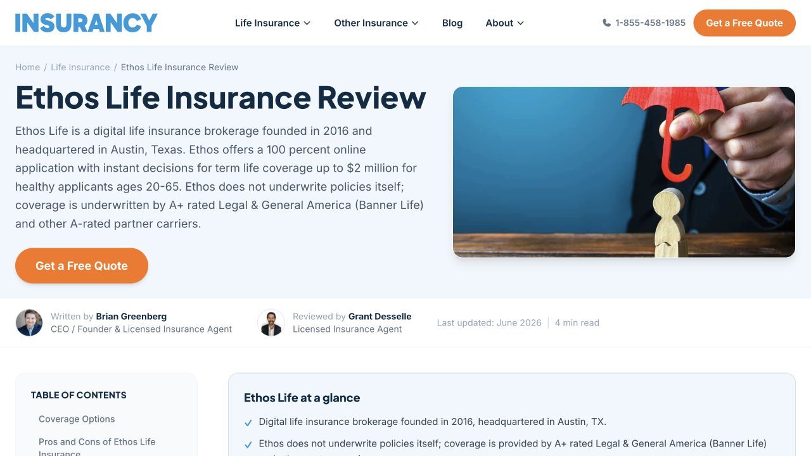
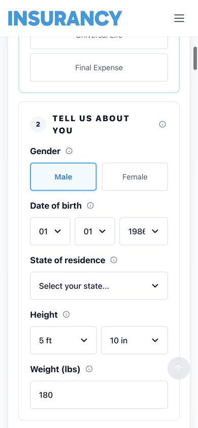
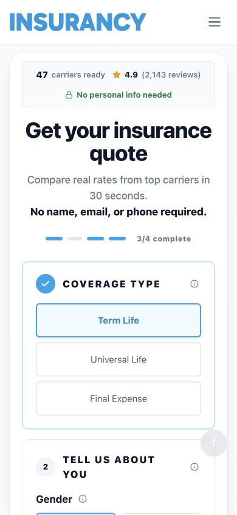

# Insurancy production conversion QA

Production audit completed July 29, 2026. This public repository is a portable handoff for developers and AI agents.

[Download the complete evidence bundle](https://github.com/GreenbergEnterprise/insurancy-qa-evidence-2026/releases/download/v2026.07.29/insurancy-qa-evidence.zip) · [Open the AI-agent handoff](AI-HANDOFF.md) · [Open the machine-readable manifest](manifest.json) · [Read the full report](report/production-qa-report.md)

## Result

The core anonymous quote flow successfully reached live carrier results and the application contact step. No real lead was submitted.

| Coverage | Result |
|---|---:|
| Production URLs fetched | 1,400 |
| Internal link instances | 39,380 |
| Confirmed internal 404s | 1 |
| Unique external 404 targets | 30 |
| Homepage-linked funnel routes loaded | 12 of 12 |
| Ticket-ready findings | 8 |

## Work queue

| Ticket | Priority | Finding | Ticket file | Evidence |
|---|---:|---|---|---|
| INS-001 | P0 | Legacy quote links open 404 pages | [Open ticket](tickets/INS-001-fix-legacy-quote-404s.md) | [Source](screenshots/legacy-quote-source-cancer.png) · [404](screenshots/broken-legacy-quote-404.png) |
| INS-002 | P1 | Broken iROI journey and incorrect 404 title | [Open ticket](tickets/INS-002-fix-iroi-broken-link-and-404-metadata.md) | [Screenshot](screenshots/broken-iroi-404.png) |
| INS-003 | P1 | Zero-cent premium renders as `$22.` | [Open ticket](tickets/INS-003-fix-truncated-zero-cent-prices.md) | [Screenshot](screenshots/mobile-banner-price-format.png) |
| INS-004 | P1 | Ameritas logo opens the Ethos review | [Open ticket](tickets/INS-004-fix-ameritas-logo-misroute.md) | [Source](screenshots/ameritas-logo-source.png) · [Destination](screenshots/ameritas-logo-wrong-destination.png) |
| INS-005 | P1 | Quote and result controls lack accessible names | [Open ticket](tickets/INS-005-label-quote-and-results-controls.md) | [Quote fields](screenshots/mobile-quote-fields-390x844.png) · [Quiz](screenshots/desktop-policy-quiz-step2.png) |
| INS-006 | P2 | Fresh quote form reports `3/4 complete` | [Open ticket](tickets/INS-006-correct-initial-quote-progress.md) | [Screenshot](screenshots/mobile-quote-form-centered-390x844.png) |
| INS-007 | P2 | 30 unique external destinations return 404 | [Open ticket](tickets/INS-007-clean-up-external-404-links.md) | [CSV](data/external-404-links.csv) |
| INS-008 | P3 | Low-priority page and image semantics | [Open ticket](tickets/INS-008-fix-low-priority-page-semantics.md) | [Audit JSON](data/production-audit.json) |

[Download the compact ticket list as CSV](tickets/tickets.csv).

## High-priority screenshot evidence

Each image below links to its full-resolution PNG. The [manifest](manifest.json) also includes direct `raw.githubusercontent.com` URLs that a remote AI agent can fetch without parsing this page.

### INS-001 — legacy quote dead end

### INS-002 — broken iROI route

### INS-003 — malformed zero-cent price

### INS-004 — Ameritas opens Ethos

### INS-005 and INS-006 — quote controls and initial progress

## All public screenshots

- [Desktop homepage baseline](screenshots/desktop-home-hero.png)
- [Mobile homepage baseline](screenshots/mobile-home-390x844.png)
- [Mobile menu](screenshots/mobile-menu-open-390x844.png)
- [Mobile Life Insurance submenu](screenshots/mobile-life-menu-open-390x844.png)
- [Mobile quote entry](screenshots/mobile-quote-form-390x844.png)
- [Mobile quote form and initial progress](screenshots/mobile-quote-form-centered-390x844.png)
- [Mobile quote fields](screenshots/mobile-quote-fields-390x844.png)
- [Live quote results](screenshots/quote-results-popup-441x897.png)
- [Malformed Banner Life price](screenshots/mobile-banner-price-format.png)
- [Policy-type quiz step 2](screenshots/desktop-policy-quiz-step2.png)
- [Application policy summary](screenshots/mobile-application-start-390x844.png)
- [Application contact step](screenshots/mobile-application-contact-form-390x844.png)
- [Broken iROI destination](screenshots/broken-iroi-404.png)
- [Legacy quote source](screenshots/legacy-quote-source-cancer.png)
- [Legacy quote 404](screenshots/broken-legacy-quote-404.png)
- [Ameritas logo source](screenshots/ameritas-logo-source.png)
- [Ameritas wrong destination](screenshots/ameritas-logo-wrong-destination.png)

## Data and limits

- [Complete production audit JSON](data/production-audit.json)
- [Internal broken-link CSV](data/internal-broken-links.csv)
- [External 404 CSV](data/external-404-links.csv)
- [Rate-funnel smoke JSON](data/rate-funnel-smoke.json)
- [Rate-funnel smoke CSV](data/rate-funnel-smoke.csv)
- [Reusable crawler](scripts/site_qa_audit.py)
- [Evidence-table builder](scripts/build_audit_tables.py)

The browser surface supported screenshots but not a real session video recording. No synthetic video is presented as original interaction evidence. Two debug/stitching-artifact screenshots were excluded from this public repository. External bot-blocked results are not classified as confirmed dead links.

This repository is public so another AI agent can fetch the evidence. It is not configured to expire automatically and should be deleted or made private when the handoff is complete.
